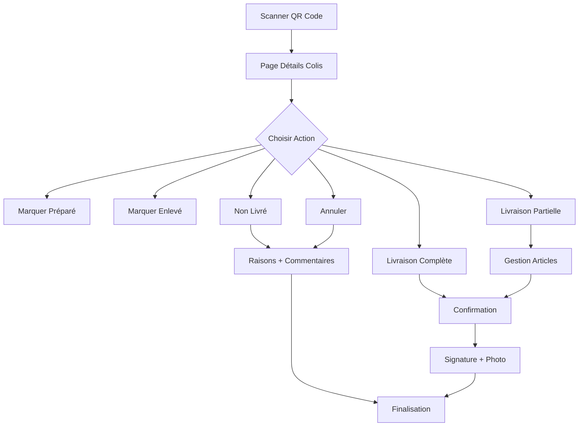

# Plan d'Interface Frontend pour les Livreurs

## 1. Vue d'ensemble du Projet

Développement d'une interface frontend moderne pour les livreurs utilisant Vue.js 3, Tailwind CSS et Frappe UI, permettant la gestion complète du workflow de livraison des colis via scan QR Code.

- **Objectif** : Simplifier et digitaliser le processus de livraison pour les livreurs
- **Technologies** : Vue.js 3, Tailwind CSS, Frappe UI, Vite
- **Intégration** : APIs Frappe Framework pour la gestion des doctypes Colis et Articles Colis

## 2. Fonctionnalités Principales

### 2.1 Rôles Utilisateurs

| Rôle | Méthode d'Accès | Permissions Principales |
|------|-----------------|-------------------------|
| Livreur | Scan QR Code du colis | Peut modifier les statuts de livraison, ajouter photos/signatures, gérer les articles |

### 2.2 Modules de Fonctionnalités

Notre interface livreurs comprend les pages principales suivantes :

1. **Page d'Accueil** : Scanner QR Code, navigation rapide
2. **Page Détails Colis** : Informations colis, gestion statuts, liste articles
3. **Page Gestion Articles** : Sélection articles livrés, quantités, statuts individuels
4. **Page Confirmation** : Signature client, photo livraison, commentaires

### 2.3 Détails des Pages

| Page | Module | Description des Fonctionnalités |
|------|--------|----------------------------------|
| Accueil | Scanner QR | Scanner le QR Code du colis pour accéder aux détails. Interface simple avec caméra intégrée |
| Accueil | Navigation | Accès rapide aux derniers colis, historique, profil livreur |
| Détails Colis | Informations Colis | Afficher numéro séquence, client, date, statut actuel, bon de livraison |
| Détails Colis | Actions Statut | Boutons pour changer statut : Préparé → Enlevé → Partiellement Livré → Livré/Non Livré/Annulé |
| Détails Colis | Liste Articles | Afficher tous les articles avec quantités totales, livrées, restantes |
| Gestion Articles | Sélection Articles | Interface pour sélectionner articles à livrer avec quantités modifiables |
| Gestion Articles | Statuts Individuels | Marquer chaque article comme livré/partiellement livré/non livré |
| Gestion Articles | Raisons Non-Livraison | Sélection raisons : Client absent, Adresse incorrecte, Refus client, Article endommagé, etc. |
| Confirmation | Signature Client | Capture signature numérique du client |
| Confirmation | Photo Livraison | Prise de photo comme preuve de livraison |
| Confirmation | Commentaires | Zone texte pour commentaires livreur et raisons détaillées |

## 3. Workflow Principal

**Flux Livreur Standard :**
1. Livreur scanne le QR Code du colis
2. Accès automatique à la page détails du colis
3. Consultation des informations et articles
4. Changement de statut selon la situation :
   - **Préparé** : Colis prêt pour enlèvement
   - **Enlevé** : Colis récupéré du dépôt
   - **Partiellement Livré** : Sélection articles livrés + quantités
   - **Livré** : Tous articles livrés + signature + photo
   - **Non Livré** : Raison + commentaire
   - **Annulé** : Annulation avec justification

**Flux Livraison Partielle :**
1. Sélection du statut "Partiellement Livré"
2. Interface de gestion des articles avec quantités
3. Sélection des articles effectivement livrés
4. Mise à jour automatique des quantités restantes
5. Signature client et photo si nécessaire



## 4. Design de l'Interface

### 4.1 Style de Design

- **Couleurs Principales** : Bleu (#3B82F6) pour les actions principales, Vert (#10B981) pour les validations
- **Couleurs Secondaires** : Gris (#6B7280) pour les textes, Rouge (#EF4444) pour les erreurs
- **Style Boutons** : Boutons arrondis (rounded-lg) avec ombres légères
- **Police** : Inter ou système par défaut, tailles 14px-18px pour lisibilité mobile
- **Layout** : Design mobile-first avec cartes (cards) pour organiser le contenu
- **Icônes** : Heroicons ou Lucide pour cohérence avec Frappe UI

### 4.2 Aperçu Design des Pages

| Page | Module | Éléments UI |
|------|--------|-------------|
| Accueil | Scanner QR | Grande zone caméra centrée, bouton scan prominent, overlay guide visuel |
| Accueil | Navigation | Cards avec icônes pour accès rapide, liste derniers colis |
| Détails Colis | En-tête | Badge statut coloré, numéro colis, informations client en cards |
| Détails Colis | Actions | Boutons statut avec couleurs distinctives, confirmations modales |
| Gestion Articles | Liste | Table responsive avec checkboxes, inputs quantité, badges statut |
| Gestion Articles | Contrôles | Boutons +/- pour quantités, sélecteurs raisons, validation globale |
| Confirmation | Capture | Zone signature tactile, prévisualisation photo, champs commentaires |

### 4.3 Responsivité

Application mobile-first optimisée pour smartphones avec support tablettes. Interface tactile optimisée pour utilisation terrain avec gants.

## 5. Architecture Technique

### 5.1 Structure Frontend

**Configuration Serveur :**
- **URL Production** : https://log.intrapro.net (port 80)
- **Mode** : Développement activé en production
- **Proxy** : Vite dev server → Frappe backend
- **HTTPS** : Certificat SSL configuré

**Basé sur Frappe UI Starter Template :**
- **Framework** : Vue.js 3 avec Composition API
- **Styling** : Tailwind CSS + Frappe UI components
- **Build Tool** : Vite avec proxy vers https://log.intrapro.net
- **Router** : Vue Router pour navigation SPA
- **State Management** : Pinia pour gestion état global

### 5.2 Intégration Frappe

**APIs Frappe utilisées :**
- `frappe.client.get_doc()` : Récupération données colis
- `frappe.client.set_value()` : Mise à jour statuts
- `frappe.client.submit_doc()` : Validation changements
- APIs custom pour gestion articles et quantités

**Configuration requise :**
- `site_config.json` : `"ignore_csrf": 1` pour développement
- Permissions Guest sur doctype Colis pour accès QR
- Hooks personnalisés pour validation workflow

### 5.3 Structure Dossiers

```
log/
├── frontend/                 # Application Vue.js
│   ├── src/
│   │   ├── components/      # Composants réutilisables
│   │   │   ├── Scanner/
│   │   │   ├── ColisDetails/
│   │   │   ├── ArticleManager/
│   │   │   └── Confirmation/
│   │   ├── views/          # Pages principales
│   │   │   ├── Home.vue
│   │   │   ├── ColisView.vue
│   │   │   └── ArticleManagement.vue
│   │   ├── composables/
│   │   │   ├── useQRScanner.js
│   │   │   ├── useColisAPI.js
│   │   │   └── useStatusManager.js
│   │   ├── stores/         # Gestion d'état (Pinia)
│   │   │   └── colis.js
│   │   ├── utils/          # Utilitaires
│   │   │   ├── api.js
│   │   │   └── constants.js
│   │   └── router/         # Configuration des routes
│   ├── public/
│   ├── vite.config.js      # Config proxy production
│   └── package.json
└── log/
    └── api/                 # APIs backend Frappe
```

## 6. Plan de Développement

### Phase 1 : Setup et Infrastructure (2-3 jours)
1. Installation Frappe UI Starter template
2. Configuration proxy vers https://log.intrapro.net
3. Setup routing et structure de base avec variables d'environnement
4. Intégration APIs Frappe de base avec authentification HTTPS

### Phase 2 : Fonctionnalités Core (4-5 jours)
1. Scanner QR Code et navigation
2. Page détails colis avec données
3. Système changement statuts basique
4. Interface gestion articles

### Phase 3 : Fonctionnalités Avancées (3-4 jours)
1. Gestion livraisons partielles
2. Capture signature et photos
3. Système commentaires et raisons
4. Validation et gestion erreurs

### Phase 4 : Polish et Tests (2-3 jours)
1. Optimisation UI/UX mobile
2. Tests fonctionnels sur https://log.intrapro.net
3. Build de production vers /log/www/frontend
4. Documentation utilisateur et configuration déploiement

## 7. Considérations Techniques

### 7.1 Configuration Production HTTPS

**Serveur de Production :**
- **URL** : https://log.intrapro.net (port 80 avec redirection HTTPS)
- **Mode Développement** : Activé pour debugging en production
- **Certificat SSL** : Configuré et valide
- **Proxy Vite** : Configuration sécurisée vers backend Frappe

**Configuration Vite pour Production :**
```javascript
// vite.config.js
export default defineConfig({
  server: {
    proxy: {
      '^/api/.*': {
        target: 'https://log.intrapro.net',
        changeOrigin: true,
        secure: true,
        headers: {
          'Origin': 'https://log.intrapro.net'
        }
      }
    }
  },
  build: {
    outDir: '../log/www/frontend'
  }
})
```

### 7.2 Sécurité
- **Authentification** : Tokens JWT via Frappe avec HTTPS
- **Validation** : Côté serveur pour tous changements statut
- **HTTPS Obligatoire** : Pour géolocalisation, caméra et sécurité
- **CSP** : Content Security Policy pour prévenir XSS
- **CORS** : Configuration correcte pour https://log.intrapro.net
- **SSL Pinning** : Validation certificat côté client
- **Tokens CSRF** : En production
- **Permissions** : Granulaires par rôle

### 7.3 Performance
- **Lazy Loading** : Chargement des composants à la demande
- **Code Splitting** : Division du bundle pour optimiser le chargement
- **Cache Local** : Pour données fréquentes
- **Optimisation Images** : Compression, formats modernes
- **HTTPS/2** : Optimisation des requêtes parallèles

### 7.4 Offline/PWA
- **Service Worker** : Cache basique des ressources
- **PWA** : Progressive Web App pour installation
- **Synchronisation** : Différée des actions
- **Indicateurs** : État connexion
- **Responsive** : Design adaptatif tous écrans
- **Touch** : Optimisation pour interactions tactiles

## 8. APIs Backend Frappe

### 8.1 Endpoints Requis

**Gestion Colis :**
```python
# /api/method/log.api.colis.get_colis
@frappe.whitelist()
def get_colis(qr_code):
    """Récupère les détails d'un colis via QR code"""
    # Validation HTTPS et authentification
    
# /api/method/log.api.colis.update_status
@frappe.whitelist()
def update_status(colis_id, new_status, comment=None):
    """Met à jour le statut d'un colis"""
    # Log des changements pour audit
```

**Gestion Articles :**
```python
# /api/method/log.api.articles.update_delivery
@frappe.whitelist()
def update_delivery(colis_id, articles_data):
    """Met à jour les quantités livrées par article"""
    # Validation des quantités et stock
```

**Upload Fichiers :**
```python
# /api/method/log.api.files.upload_photo
@frappe.whitelist()
def upload_photo(colis_id, photo_data, photo_type):
    """Upload photo de livraison ou signature"""
    # Validation taille et format, stockage sécurisé
```

### 8.2 Configuration Sécurité API

**Headers Requis :**
```python
# Dans hooks.py
website_route_rules = [
    {"from_route": "/frontend/<path:app_path>", "to_route": "/frontend"},
]

# Configuration CORS pour développement
if frappe.conf.developer_mode:
    website_cors = {
        "origins": ["http://localhost:8080", "https://log.intrapro.net"],
        "allow_credentials": True
    }
```

**Estimation totale : 11-15 jours de développement**