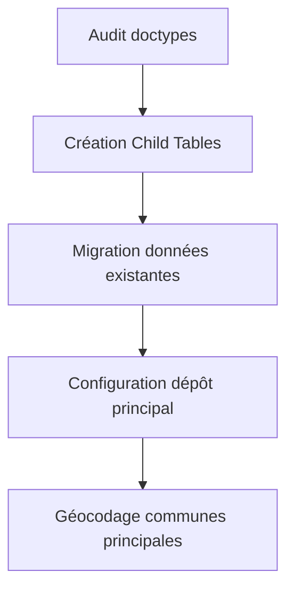
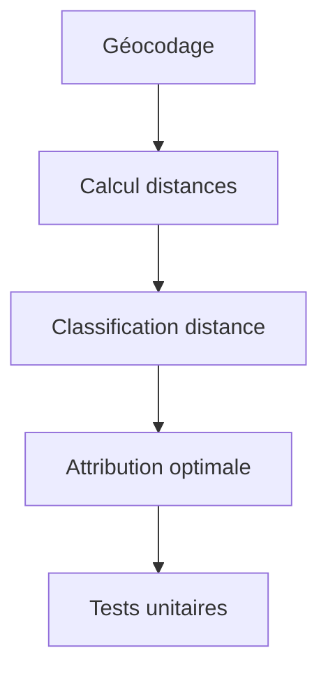
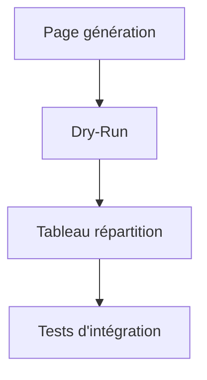
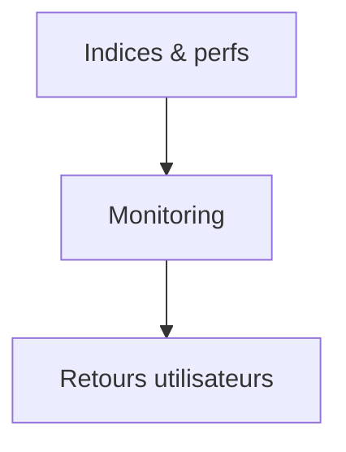

parfait — voici **ton document intégral mis à jour**, prêt à être versionné dans ton app Frappe/ERPNext.
Il remplace totalement l’ancien, supprime toute gestion de poids/volume, applique les **bonnes pratiques Frappe**, inclut **transactions, update atomique, idempotence (batch\_id)**, **jobs planifiés**, **sécurité**, **tests**, et le **Front‑end complet** avec bouton **Dry‑Run** (`simulate=True`).

---

# Spécification Technique : Système de Répartition Automatique des Livraisons

## 1. Vue d’ensemble du projet

### 1.1 Contexte

La répartition des bons de livraison est actuellement manuelle et centrée sur un seul livreur.
Objectif : **automatiser** la distribution des colis entre plusieurs livreurs selon :

* Capacité maximale (en **nombre de colis** uniquement)
* Zones géographiques (wilayas/communes)
* Type de couverture (Locale / Régionale / Nationale / Spécialisée)
* Spécialisation (ex. longue distance)
* (Optionnel) Coût/km du véhicule

### 1.2 Problématiques identifiées

* **VRP (Vehicle Routing Problem)** : optimisation des tournées (phase ultérieure)
* **Load Balancing** : équilibre du nombre de colis entre livreurs
* **Contraintes géographiques** : distinction Local / Régional / Éloigné

### 1.3 Structure organisationnelle

* **1 livreur spécialisé** : longues distances (gros véhicule)
* **Plusieurs livreurs locaux** : véhicules standards, zones proches
* **Collecte matinale** : tous les livreurs chargent le matin
* **Distribution journalière** : livraisons dans la journée

---

## 2. Architecture technique

### 2.1 Doctypes à adapter (bonnes pratiques : Child Tables + index)

#### Doctype `Livreur`

**Champs existants :** `status`, `id_utilisateur`, `nom`, `vehicule`, `permis`, `valable`, `active`

**Nouveaux champs (remplacement des Table MultiSelect par Child Tables) :**

```json
{
  "wilayas_couverture": {
    "fieldtype": "Table",
    "label": "Wilayas couvertes",
    "options": "Livreur Wilaya"
  },
  "communes_specifiques": {
    "fieldtype": "Table",
    "label": "Communes spécifiques",
    "options": "Livreur Commune"
  },
  "type_couverture": {
    "fieldtype": "Select",
    "label": "Type de couverture",
    "options": "Locale\nRégionale\nNationale\nSpécialisée"
  },
  "capacite_max_colis": {
    "fieldtype": "Int",
    "label": "Capacité maximale (colis)"
  },
  "charge_actuelle": {
    "fieldtype": "Int",
    "label": "Charge actuelle",
    "default": 0,
    "read_only": 1
  },
  "priorite_attribution": {
    "fieldtype": "Int",
    "label": "Priorité d'attribution (1-10)",
    "default": 5
  },
  "specialisation": {
    "fieldtype": "Select",
    "label": "Spécialisation",
    "options": "Standard\nLongue distance\nColis fragiles\nLivraison express"
  }
}
```

#### Child Doctypes

* **`Livreur Wilaya`** : `parent` (Link → Livreur), `parenttype`, `parentfield`, `wilaya` (Link → Wilaya)
* **`Livreur Commune`** : `parent` (Link → Livreur), `parenttype`, `parentfield`, `commune` (Link → Commune)
* **`Vehicule Wilaya`** : `parent` (Link → Vehicule), `parenttype`, `parentfield`, `wilaya` (Link → Wilaya)

#### Doctype `Vehicule`

**Champs existants :** `status`, `nom`, `type`, `chauffeur`, `immatriculation`, `charge`, `km`, `date_dernier_entretien`, `carte_grise`, `assurance`, `controle_technique`, `vignette`, `active`, `type_carb`

**Nouveaux champs :**

```json
{
  "rayon_action_km": { "fieldtype": "Int", "label": "Rayon d'action (km)" },
  "wilayas_autorisees": { "fieldtype": "Table", "label": "Wilayas autorisées", "options": "Vehicule Wilaya" },
  "cout_km": { "fieldtype": "Currency", "label": "Coût par kilomètre" }
}
```

#### Doctype `Commune` (ajouts)

```json
{
  "latitude":   { "fieldtype": "Float", "label": "Latitude",  "precision": "8" },
  "longitude":  { "fieldtype": "Float", "label": "Longitude", "precision": "8" },
  "distance_depot": { "fieldtype": "Float", "label": "Distance du dépôt (km)", "read_only": 1 }
}
```

#### Nouveau Doctype `Depot Distribution`

```json
{
  "nom":            { "fieldtype": "Data",  "label": "Nom du dépôt", "reqd": 1 },
  "adresse":        { "fieldtype": "Small Text", "label": "Adresse" },
  "latitude_depot": { "fieldtype": "Float", "label": "Latitude",  "precision": "8" },
  "longitude_depot":{ "fieldtype": "Float", "label": "Longitude", "precision": "8" },
  "is_default":     { "fieldtype": "Check", "label": "Dépôt principal" }
}
```

**Validation (unicité du dépôt par défaut) :**

```python
# depot_distribution.py (DocType Class)
def validate(self):
    if self.is_default:
        frappe.db.sql("UPDATE `tabDepot Distribution` SET is_default=0 WHERE name!=%s", self.name)
```

### 2.2 Index de performance (patch)

```python
# patches/2025_08_12_add_indexes_for_distribution.py
import frappe

def execute():
    frappe.db.add_index("Commune", ["wilaya"])
    frappe.db.add_index("Commune", ["distance_depot"])
    frappe.db.add_index("Livraison Colis", ["date_livraison", "statut", "commune"])
    frappe.db.add_index("Livreur", ["active"])
    frappe.db.add_index("Livreur", ["specialisation"])
    frappe.db.add_index("Livreur", ["type_couverture"])
```

### 2.3 Paramètres (Single Doc)

Créer **Parametres Livraison** (Single) :

* `seuil_local_km` (Int, default 20)
* `seuil_regional_km` (Int, default 100)

---

## 3. Système de géolocalisation

### 3.1 Dépendance

```bash
pip install geopy
```

### 3.2 Utilitaires

`apps/log/log/utils/geolocation.py`

```python
import frappe
from geopy.geocoders import Nominatim
from geopy.extra.rate_limiter import RateLimiter
from geopy.distance import geodesic

@frappe.whitelist()
def geocoder_communes():
    """Géocode toutes les communes sans coordonnées (respect RateLimiter)."""
    geolocator = Nominatim(user_agent="log_erpnext")
    geocode = RateLimiter(geolocator.geocode, min_delay_seconds=1)

    communes = frappe.get_all("Commune",
        filters=[["latitude","is","not set"]],
        fields=["name", "nom", "wilaya"]
    )
    for c in communes:
        try:
            q = f"{c.nom}, {c.wilaya}, Algérie"
            loc = geocode(q)
            if loc:
                frappe.db.set_value("Commune", c.name, {
                    "latitude": loc.latitude,
                    "longitude": loc.longitude
                })
        except Exception as e:
            frappe.log_error(f"Erreur géocodage {c.nom}: {e}")
    frappe.db.commit()

@frappe.whitelist()
def calculer_distances_depot():
    """Calcule la distance (km) du dépôt par défaut jusqu'à chaque commune géocodée."""
    depot = frappe.get_doc("Depot Distribution", {"is_default": 1})
    depot_coords = (depot.latitude_depot, depot.longitude_depot)

    communes = frappe.get_all("Commune",
        filters=[["latitude","is","set"]],
        fields=["name", "latitude", "longitude"]
    )
    for c in communes:
        d = geodesic(depot_coords, (c.latitude, c.longitude)).km
        frappe.db.set_value("Commune", c.name, "distance_depot", round(d, 2))
    frappe.db.commit()
```

### 3.3 Jobs planifiés

`hooks.py`

```python
scheduler_events = {
    "daily": [
        "log.log.utils.geolocation.geocoder_communes",
        "log.log.utils.geolocation.calculer_distances_depot",
    ]
}
```

---

## 4. Algorithmes de répartition

### 4.1 Classification géographique (Local/Régional/Éloigné)

`apps/log/log/utils/distribution.py`

```python
import frappe
from frappe.utils import cint

def classifier_livraison_par_distance(commune_name):
    """Retourne: 'Locale' / 'Régionale' / 'Éloignée' selon distance_depot et seuils Single Doc."""
    dist = frappe.get_value("Commune", commune_name, "distance_depot") or 0
    seuil_local = cint(frappe.db.get_single_value("Parametres Livraison", "seuil_local_km") or 20)
    seuil_regional = cint(frappe.db.get_single_value("Parametres Livraison", "seuil_regional_km") or 100)
    if dist <= seuil_local: return "Locale"
    if dist <= seuil_regional: return "Régionale"
    return "Éloignée"
```

### 4.2 Attribution optimale (nombre de colis uniquement)

**Principes :** transaction, **update atomique** de la charge, score multi‑critères (charge, zone, coût/km optionnel, priorité), respect de la capacité.

```python
from contextlib import contextmanager

@contextmanager
def db_txn():
    try:
        yield
        frappe.db.commit()
    except:
        frappe.db.rollback()
        raise

def incrementer_charge(livreur_id, nb_colis):
    """Incrément atomique de charge_actuelle pour éviter les races."""
    frappe.db.sql("""
        UPDATE `tabLivreur`
           SET charge_actuelle = charge_actuelle + %(n)s
         WHERE name=%(id)s
           AND (charge_actuelle + %(n)s) <= capacite_max_colis
    """, {"id": livreur_id, "n": nb_colis})
    if frappe.db.rowcount == 0:
        frappe.throw("Capacité maximale dépassée pour ce livreur")

def livreurs_couvrant_commune(commune):
    """Livreurs couvrant la wilaya de la commune (via Child Table)."""
    wilaya = frappe.db.get_value("Commune", commune, "wilaya")
    parents = frappe.get_all("Livreur Wilaya", filters={"wilaya": wilaya}, fields=["parent"])
    return {p.parent for p in parents}

def attribuer_livreur_optimal(classification, nb_colis, commune_name=None):
    """Retourne le nom du livreur avec le meilleur score, ou None si aucun candidat."""
    filters = {"active": 1}
    if classification == "Éloignée":
        filters["specialisation"] = "Longue distance"
    elif classification == "Régionale":
        filters["type_couverture"] = ["in", ["Régionale", "Nationale"]]
    else:
        filters["type_couverture"] = "Locale"

    candidats = frappe.get_all("Livreur", filters=filters,
        fields=["name", "charge_actuelle", "capacite_max_colis", "priorite_attribution", "vehicule"])
    if not candidats:
        return None

    couvre = livreurs_couvrant_commune(commune_name) if commune_name else set()

    veh_rows = frappe.get_all("Vehicule",
        filters={"name": ["in", [c.vehicule for c in candidats if c.vehicule]]},
        fields=["name", "cout_km"])
    veh_map = {v.name: (v.cout_km or 0) for v in veh_rows}

    couts = [veh_map.get(c.vehicule, 0) for c in candidats]
    min_c, max_c = (min(couts) if couts else 0), (max(couts) if couts else 0)

    def normalise(x, lo, hi):
        return 0 if hi == lo else max(0, min(1, (x - lo) / (hi - lo)))

    for c in candidats:
        taux_charge = (c.charge_actuelle or 0) / float(c.capacite_max_colis or 1)
        penalite_zone = 0 if (not commune_name or c.name in couvre) else 1
        cout_km_norm = normalise(veh_map.get(c.vehicule, 0), min_c, max_c)
        prio_norm = normalise((c.priorite_attribution or 5), 1, 10)
        # pondérations: charge (0.55), zone (0.25), coût (0.15), priorité (0.05)
        c._score = 0.55*taux_charge + 0.25*penalite_zone + 0.15*cout_km_norm + 0.05*(1 - prio_norm)

    choisi = min(candidats, key=lambda x: x._score)
    if (choisi.capacite_max_colis or 0) <= 0:
        return None
    if (choisi.charge_actuelle or 0) + nb_colis > (choisi.capacite_max_colis or 0):
        return None
    return choisi.name
```

### 4.3 Répartition automatique (API) — avec **Dry‑Run** et **idempotence**

```python
import uuid

@frappe.whitelist()
def repartir_livraisons_automatique(date_livraison, mode="auto", simulate=False):
    """Répartit les colis 'En attente' d'une date par livreur.
    simulate=True => ne modifie pas la DB (pas d'incrément charge, pas de création Livraison)."""
    # Contrôle d'accès côté serveur (bonne pratique)
    if not frappe.has_permission(doctype="Livraison", ptype="write"):
        frappe.throw("Permission refusée.")

    batch_id = str(uuid.uuid4())

    with db_txn():
        # 1) Récupération des colis
        colis_a_livrer = frappe.get_all("Livraison Colis",
            filters={"date_livraison": date_livraison, "statut": "En attente"},
            fields=["name", "commune", "priorite"]
        )

        # 2) Groupement par commune
        par_commune = {}
        for c in colis_a_livrer:
            par_commune.setdefault(c.commune, []).append(c)

        # 3) Attribution par commune
        repartition, livraisons_creees = {}, []
        for commune, lst in par_commune.items():
            classification = classifier_livraison_par_distance(commune)
            nb_colis = len(lst)
            livreur_id = attribuer_livreur_optimal(classification, nb_colis, commune)
            if not livreur_id:
                frappe.log_error(f"Aucun livreur éligible pour {commune} ({nb_colis} colis)")
                continue

            if not simulate:
                incrementer_charge(livreur_id, nb_colis)

            rep = repartition.setdefault(livreur_id, {
                "livreur": livreur_id,
                "colis": [],
                "communes": [],
                "total_colis": 0,
                "taux_charge": 0
            })
            rep["colis"].extend(lst)
            rep["communes"].append(commune)
            rep["total_colis"] += nb_colis

        # 4) Taux de charge + création des Livraisons
        for livreur_id, data in repartition.items():
            cap = frappe.db.get_value("Livreur", livreur_id, "capacite_max_colis") or 0
            charge = frappe.db.get_value("Livreur", livreur_id, "charge_actuelle") or 0
            data["taux_charge"] = round(100 * (charge / cap), 2) if cap else 0

            if not simulate:
                livraison = frappe.new_doc("Livraison")
                livraison.date_liv = date_livraison
                livraison.livreur = livreur_id
                livraison.total_colis = data["total_colis"]
                livraison.batch_id = batch_id  # champ à ajouter sur Livraison (Data)
                for c in data["colis"]:
                    livraison.append("colis", {"colis": c.name, "commune": c.commune})
                livraison.save()
                livraisons_creees.append(livraison.name)

        return {
            "success": True,
            "simulate": bool(simulate),
            "batch_id": batch_id,
            "livraisons_creees": livraisons_creees,
            "repartition": repartition
        }
```

> **Note** : ajouter `batch_id` (Data) sur le Doctype **Livraison** pour tracer les relances et garantir l’idempotence (annulation/rebuild si besoin).

---

## 5. Interface utilisateur (Front‑end Frappe)

### 5.1 Page Desk : **generation-livraisons**

Créer la page (DocType **Page**) :

* **Page Name** : `generation-livraisons`
* **Module** : votre module (ex. `Log`)
* **Standard** : ✅ (si app)

Fichier JS : `apps/log/log/public/js/pages/generation_livraisons.js`

### 5.2 Code JavaScript **complet** (avec bouton **Dry‑Run**)

```javascript
// apps/log/log/public/js/pages/generation_livraisons.js
frappe.provide("log.pages");

frappe.pages["generation-livraisons"].on_page_load = function (wrapper) {
  const page = frappe.ui.make_app_page({
    parent: wrapper,
    title: "Génération des Livraisons",
    single_column: true,
  });

  const $body = $(page.body);

  // ---- Filtres (bonnes pratiques: make_control) ----
  const $filters = $(`<div class="frappe-card" style="padding:16px;margin-bottom:16px;">
      <div class="row">
        <div class="col-md-3" id="ctl_date"></div>
        <div class="col-md-3" id="ctl_mode"></div>
        <div class="col-md-3" id="ctl_dryrun"></div>
        <div class="col-md-3" id="ctl_buttons" style="display:flex;gap:8px;align-items:flex-end;"></div>
      </div>
  </div>`).appendTo($body);

  const ctl_date = frappe.ui.form.make_control({
    parent: $filters.find("#ctl_date"),
    df: { fieldtype: "Date", label: "Date de livraison", fieldname: "date_livraison", reqd: 1, default: frappe.datetime.get_today() },
    render_input: true,
  });

  const ctl_mode = frappe.ui.form.make_control({
    parent: $filters.find("#ctl_mode"),
    df: { fieldtype: "Select", label: "Mode de répartition", fieldname: "mode_repartition", options: ["auto", "semi-auto", "manuel"], default: "auto" },
    render_input: true,
  });

  const ctl_dryrun = frappe.ui.form.make_control({
    parent: $filters.find("#ctl_dryrun"),
    df: { fieldtype: "Check", label: "Dry-Run (simulation)", fieldname: "simulate", default: 1 },
    render_input: true,
  });

  page.set_primary_action("Générer", () => generer(false));
  page.add_action_item("Dry-Run (simulation)", () => generer(true));

  // ---- Résultats ----
  const $results = $(`<div class="frappe-card" style="padding:16px;">
    <h5>Répartition des livraisons</h5>
    <div id="stats_summary" style="margin-bottom:12px;"></div>
    <div id="tableau_repartition" class="mt-3"></div>
  </div>`).appendTo($body);

  function generer(force_simulate) {
    const date_livraison = ctl_date.get_value();
    const mode = ctl_mode.get_value() || "auto";
    const simulate = force_simulate ? 1 : (ctl_dryrun.get_value() ? 1 : 0);

    if (!date_livraison) {
      frappe.msgprint(__("Veuillez choisir une date de livraison."));
      return;
    }

    frappe.call({
      method: "log.log.utils.distribution.repartir_livraisons_automatique",
      freeze: true,
      freeze_message: __("Calcul de la répartition en cours..."),
      args: { date_livraison, mode, simulate },
      callback: (r) => {
        if (!r.message || !r.message.success) {
          frappe.msgprint(__("Aucune répartition générée."));
          return;
        }
        const m = r.message;
        afficher_summary(m);
        afficher_repartition(m.repartition);
        if (!m.simulate) {
          frappe.show_alert({ message: __("{0} livraisons créées", [m.livraisons_creees.length]), indicator: "green" });
        } else {
          frappe.show_alert({ message: __("Simulation terminée (aucune écriture DB)"), indicator: "blue" });
        }
      },
      error: (e) => {
        console.error(e);
        frappe.msgprint(__("Erreur lors de la génération."));
      },
    });
  }

  function afficher_summary(m) {
    const total_livreurs = Object.keys(m.repartition || {}).length;
    const total_colis = Object.values(m.repartition || {}).reduce((acc, v) => acc + (v.total_colis || 0), 0);
    $("#stats_summary").html(`
      <div><b>Batch ID:</b> ${frappe.utils.escape_html(m.batch_id || "-")}</div>
      <div><b>Mode:</b> ${m.simulate ? "Simulation" : "Exécution réelle"}</div>
      <div><b>Livreurs affectés:</b> ${total_livreurs}</div>
      <div><b>Total colis:</b> ${total_colis}</div>
    `);
  }

  function afficher_repartition(repartition) {
    let rows = "";
    Object.keys(repartition || {}).forEach((livreur_id) => {
      const data = repartition[livreur_id];
      const communes = (data.communes || []).join(", ");
      const nb = data.total_colis || 0;
      const taux = data.taux_charge || 0;
      rows += `
        <tr>
          <td>${frappe.utils.escape_html(livreur_id)}</td>
          <td>${frappe.utils.escape_html(communes)}</td>
          <td class="text-right">${nb}</td>
          <td style="min-width:180px;">
            <div class="progress" style="height:18px;">
              <div class="progress-bar" role="progressbar" style="width:${taux}%;">
                ${taux}%
              </div>
            </div>
          </td>
          <td>
            <button class="btn btn-sm btn-secondary" data-livreur="${frappe.utils.escape_html(livreur_id)}">Modifier</button>
            <button class="btn btn-sm btn-info" data-livreur="${frappe.utils.escape_html(livreur_id)}">Détails</button>
          </td>
        </tr>
      `;
    });

    const html = `
      <table class="table table-bordered">
        <thead>
          <tr>
            <th>Livreur</th>
            <th>Communes</th>
            <th>Nombre de colis</th>
            <th>Taux de charge</th>
            <th>Actions</th>
          </tr>
        </thead>
        <tbody>${rows || `<tr><td colspan="5" class="text-center text-muted">Aucune donnée</td></tr>`}</tbody>
      </table>
    `;
    $("#tableau_repartition").html(html);
  }
};
```

---

## 6. Workflow de mise en œuvre

### Phase 1 : Préparation des données



### Phase 2 : Algorithmes



### Phase 3 : Interface



### Phase 4 : Optimisation & monitoring



---

## 7. Règles métier

### 7.1 Types de livreurs

* **Local** : communes ≤ seuil local (20 km), capacité 50–100 colis
* **Régional** : plusieurs wilayas adjacentes, 100–200 colis
* **Longue distance** : national, 200–500 colis

### 7.2 Priorisation

1. Tri par distance : Éloignées → Régionales → Locales
2. Attribution spécialisée : Longue distance pour éloignées
3. Équilibrage : minimiser le taux de charge
4. Optimisation géographique : regroupement par commune

---

## 8. Sécurité & permissions

* **Contrôle permission côté serveur** dans `repartir_livraisons_automatique` (write sur `Livraison`)
* **Permission Query** sur `Livraison` pour limiter la visibilité au livreur connecté (si rôle Livreur)
* Rôles :

  * **Gestionnaire Logistique** : config + génération
  * **Superviseur Livraison** : visualisation/modification
  * **Livreur** : lecture de ses livraisons
* **Logs** : `frappe.log_error` pour cas sans candidats

---

## 9. Métriques & KPIs

* **Taux d’utilisation** : charge\_actuelle / capacite\_max\_colis
* **Équilibrage** : écart-type du nombre de colis par livreur
* **Distance moyenne / livraison** (si infos disponibles)
* **Stops moyen / tournée**

*(Dashboard optionnel, non inclus ici pour rester focus sur la répartition.)*

---

## 10. Plan de tests

### 10.1 Tests unitaires

* Géocodage (mock Nominatim)
* Distances dépôt → commune
* Classification (seuils)
* Attribution (charge/zone/priorité/coût) + respect capacité
* Atomique : double appel simultané (ne dépasse pas capacité)

### 10.2 Tests d’intégration

* **Dry‑Run** journée complète (aucune écriture)
* Exécution réelle : vérifie `charge_actuelle` + création `Livraison`
* Relance sur même date (nouveau `batch_id`)

### 10.3 Tests de charge

* 1000+ colis / 50+ livreurs / **< 5 s** visé
* Vérifie l’impact des indexes

---

## 11. Documentation technique

### 11.1 APIs

```python
@frappe.whitelist()
def repartir_livraisons_automatique(date_livraison, mode="auto", simulate=False)

@frappe.whitelist() 
def geocoder_communes()

@frappe.whitelist()
def calculer_distances_depot()

# (optionnel)
@frappe.whitelist()
def get_delivery_metrics(date_debut=None, date_fin=None)
```

### 11.2 Configuration système (Single Doc)

```json
{
  "parametres_livraison": {
    "seuil_local_km": 20,
    "seuil_regional_km": 100,
    "api_geolocation": "nominatim",
    "rate_limit_geocoding": 1,
    "auto_update_distances": true,
    "algorithme_repartition": "load_balancing_geographique"
  }
}
```

### 11.3 Hooks

```python
scheduler_events = {
    "daily": [
        "log.log.utils.geolocation.geocoder_communes",
        "log.log.utils.geolocation.calculer_distances_depot",
    ]
}
```

### 11.4 Checklist de déploiement

* [ ] Créer Child Doctypes (`Livreur Wilaya`, `Livreur Commune`, `Vehicule Wilaya`)
* [ ] Ajouter/adapter champs sur `Livreur`, `Vehicule`, `Commune`, `Livraison` (`batch_id`), `Depot Distribution`
* [ ] Appliquer patch des **index**
* [ ] Créer Page **generation-livraisons** + déposer le JS
* [ ] Créer Single **Parametres Livraison** + valeurs par défaut
* [ ] Configurer **Scheduled Jobs** (géocodage + distances)
* [ ] Vérifier **permissions & queries**
* [ ] Lancer **tests** unitaires/intégration/charge

---

si tu veux, je peux aussi te générer les **fixtures JSON** (export DocType) pour :

* `Parametres Livraison` (Single),
* `Livreur Wilaya` / `Livreur Commune` / `Vehicule Wilaya`,
* ajout du champ `batch_id` sur `Livraison`.
