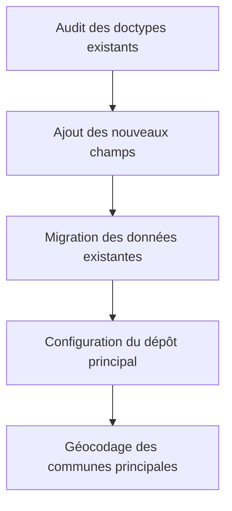
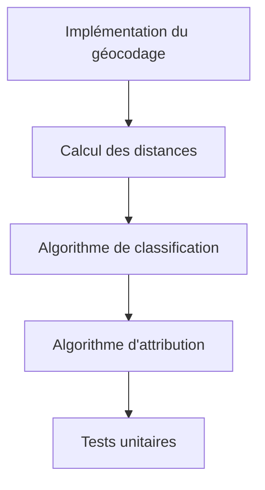
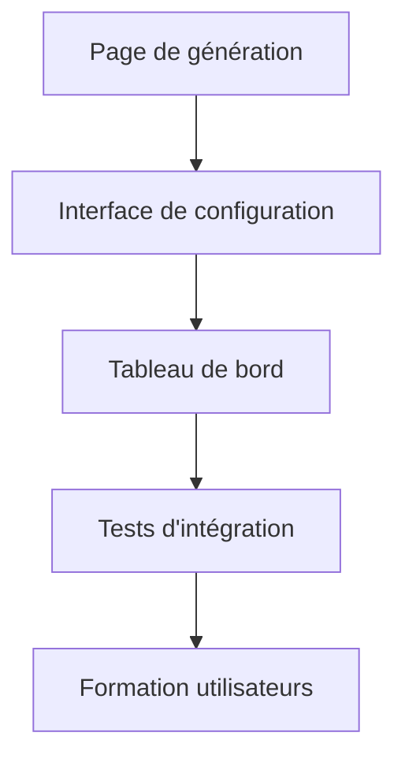
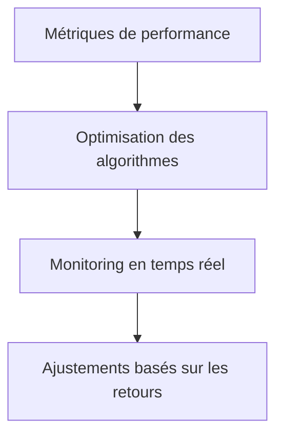

# Spécification Technique : Système de Répartition Automatique des Livraisons

## 1. Vue d'ensemble du projet

### 1.1 Contexte
Actuellement, le système récupère tous les bons de livraison pour une date et un livreur sélectionnés. L'objectif est d'implémenter un système de répartition automatique des colis entre plusieurs livreurs en utilisant les meilleures pratiques du domaine logistique.

### 1.2 Problématique identifiée
- **Vehicle Routing Problem (VRP)** : Problème d'optimisation combinatoire pour déterminer les routes optimales
- **Load Balancing** : Répartition équilibrée de la charge de travail entre les livreurs
- **Contraintes géographiques** : Gestion des zones éloignées vs zones locales

### 1.3 Structure organisationnelle actuelle
- **1 livreur spécialisé** : Gros véhicule pour les régions éloignées
- **Plusieurs livreurs locaux** : Véhicules standards pour les zones proches
- **Collecte matinale** : Tous les livreurs récupèrent leurs colis le matin
- **Livraison journalière** : Distribution tout au long de la journée

## 2. Architecture technique

### 2.1 Doctypes existants à adapter

#### Doctype `Livreur`
**Champs existants :**
- `status`, `id_utilisateur`, `nom`, `vehicule`
- `permis`, `valable`, `active`

**Nouveaux champs à ajouter :**
```json
{
  "zone_geographique": {
    "fieldtype": "Table MultiSelect",
    "label": "Zones de couverture",
    "options": "Livreur Zone"
  },
  "wilayas_couverture": {
    "fieldtype": "Table MultiSelect", 
    "label": "Wilayas couvertes",
    "options": "Livreur Wilaya"
  },
  "communes_specifiques": {
    "fieldtype": "Table MultiSelect",
    "label": "Communes spécifiques",
    "options": "Livreur Commune"
  },
  "type_couverture": {
    "fieldtype": "Select",
    "label": "Type de couverture",
    "options": "Locale\nRégionale\nNationale\nSpécialisée"
  },
  "capacite_max_colis": {
    "fieldtype": "Int",
    "label": "Capacité maximale (colis)"
  },
  "charge_actuelle": {
    "fieldtype": "Int",
    "label": "Charge actuelle",
    "read_only": 1
  },
  "priorite_attribution": {
    "fieldtype": "Int",
    "label": "Priorité d'attribution",
    "default": "5"
  },
  "specialisation": {
    "fieldtype": "Select",
    "label": "Spécialisation",
    "options": "Standard\nLongue distance\nColis fragiles\nLivraison express"
  }
}
```

#### Doctype `Vehicule`
**Champs existants :**
- `status`, `nom`, `type`, `chauffeur`, `immatriculation`, `charge`
- `km`, `date_dernier_entretien`, `carte_grise`, `assurance`
- `controle_technique`, `vignette`, `active`, `type_carb`

**Nouveaux champs à ajouter :**
```json
{
  "rayon_action_km": {
    "fieldtype": "Int",
    "label": "Rayon d'action (km)"
  },
  "wilayas_autorisees": {
    "fieldtype": "Table MultiSelect",
    "label": "Wilayas autorisées",
    "options": "Vehicule Wilaya"
  },
  "consommation_carburant": {
    "fieldtype": "Float",
    "label": "Consommation (L/100km)"
  },
  "cout_km": {
    "fieldtype": "Currency",
    "label": "Coût par kilomètre"
  }
}
```

#### Doctype `Commune` (à adapter)
**Champs existants :**
- `nom`, `nom_ar`, `wilaya`, `region`

**Nouveaux champs à ajouter :**
```json
{
  "latitude": {
    "fieldtype": "Float",
    "label": "Latitude",
    "precision": "8"
  },
  "longitude": {
    "fieldtype": "Float",
    "label": "Longitude",
    "precision": "8"
  },
  "distance_depot": {
    "fieldtype": "Float",
    "label": "Distance du dépôt (km)",
    "read_only": 1
  }
}
```

#### Nouveau Doctype `Depot Distribution`
```json
{
  "nom": {
    "fieldtype": "Data",
    "label": "Nom du dépôt",
    "reqd": 1
  },
  "adresse": {
    "fieldtype": "Small Text",
    "label": "Adresse"
  },
  "latitude_depot": {
    "fieldtype": "Float",
    "label": "Latitude",
    "precision": "8"
  },
  "longitude_depot": {
    "fieldtype": "Float",
    "label": "Longitude",
    "precision": "8"
  },
  "is_default": {
    "fieldtype": "Check",
    "label": "Dépôt principal"
  }
}
```

### 2.2 Système de géolocalisation

#### Installation des dépendances
```bash
pip install geopy
```

#### Méthodes de géocodage
```python
# apps/log/log/utils/geolocation.py
import frappe
from geopy.geocoders import Nominatim
from geopy.distance import geodesic
from geopy.extra.rate_limiter import RateLimiter

@frappe.whitelist()
def geocoder_communes():
    """Géocode toutes les communes sans coordonnées"""
    geolocator = Nominatim(user_agent="log_erpnext")
    geocode = RateLimiter(geolocator.geocode, min_delay_seconds=1)
    
    communes = frappe.get_all("Commune", 
        filters={"latitude": ["", "is", "not set"]},
        fields=["name", "nom", "wilaya"]
    )
    
    for commune in communes:
        try:
            query = f"{commune.nom}, {commune.wilaya}, Algérie"
            location = geocode(query)
            
            if location:
                frappe.db.set_value("Commune", commune.name, {
                    "latitude": location.latitude,
                    "longitude": location.longitude
                })
                frappe.db.commit()
                
        except Exception as e:
            frappe.log_error(f"Erreur géocodage {commune.nom}: {str(e)}")

@frappe.whitelist()
def calculer_distances_depot():
    """Calcule les distances entre le dépôt et toutes les communes"""
    depot = frappe.get_doc("Depot Distribution", {"is_default": 1})
    depot_coords = (depot.latitude_depot, depot.longitude_depot)
    
    communes = frappe.get_all("Commune",
        filters={"latitude": ["", "is not", "set"]},
        fields=["name", "latitude", "longitude"]
    )
    
    for commune in communes:
        if commune.latitude and commune.longitude:
            commune_coords = (commune.latitude, commune.longitude)
            distance = geodesic(depot_coords, commune_coords).kilometers
            
            frappe.db.set_value("Commune", commune.name, 
                "distance_depot", round(distance, 2)
            )
    
    frappe.db.commit()
```

## 3. Algorithmes de répartition

### 3.1 Classification géographique
```python
# apps/log/log/utils/distribution.py
def classifier_livraison_par_distance(commune_name):
    """Classifie une livraison selon la distance"""
    commune = frappe.get_doc("Commune", commune_name)
    distance = commune.distance_depot or 0
    
    # Seuils configurables dans les paramètres système
    seuil_local = frappe.db.get_single_value("Parametres Livraison", "seuil_local") or 20
    seuil_regional = frappe.db.get_single_value("Parametres Livraison", "seuil_regional") or 100
    
    if distance <= seuil_local:
        return "Locale"
    elif distance <= seuil_regional:
        return "Régionale" 
    else:
        return "Éloignée"
```

### 3.2 Algorithme d'attribution optimale
```python
def attribuer_livreur_optimal(classification, colis_count, commune_name=None):
    """Attribue le livreur optimal selon la classification"""
    filters = {"active": 1}
    
    # Filtrage par spécialisation
    if classification == "Éloignée":
        filters["specialisation"] = "Longue distance"
    elif classification == "Régionale":
        filters["type_couverture"] = ["in", ["Régionale", "Nationale"]]
    else:
        filters["type_couverture"] = "Locale"
    
    # Filtrage par zone géographique si commune spécifiée
    if commune_name:
        commune = frappe.get_doc("Commune", commune_name)
        # Vérifier si des livreurs couvrent spécifiquement cette commune/wilaya
        filters_zone = filters.copy()
        filters_zone["wilayas_couverture"] = ["like", f"%{commune.wilaya}%"]
        
        livreurs_zone = frappe.get_all("Livreur", filters=filters_zone)
        if livreurs_zone:
            filters = filters_zone
    
    # Récupération des livreurs disponibles
    livreurs = frappe.get_all("Livreur", 
        filters=filters,
        fields=["name", "charge_actuelle", "capacite_max_colis", "priorite_attribution"]
    )
    
    if not livreurs:
        return None
    
    # Calcul du score d'attribution (charge + priorité)
    for livreur in livreurs:
        taux_charge = (livreur.charge_actuelle or 0) / (livreur.capacite_max_colis or 1)
        livreur.score = taux_charge + (livreur.priorite_attribution or 5) * 0.1
    
    # Sélection du livreur avec le meilleur score
    livreur_optimal = min(livreurs, key=lambda x: x.score)
    
    return livreur_optimal.name
```

### 3.3 Algorithme principal de répartition
```python
@frappe.whitelist()
def repartir_livraisons_automatique(date_livraison, mode="auto"):
    """Répartit automatiquement les livraisons pour une date donnée"""
    
    # 1. Récupération des colis à livrer
    colis_a_livrer = frappe.get_all("Livraison Colis",
        filters={
            "date_livraison": date_livraison,
            "statut": "En attente"
        },
        fields=["name", "commune", "poids", "volume", "priorite"]
    )
    
    # 2. Groupement par commune
    colis_par_commune = {}
    for colis in colis_a_livrer:
        commune = colis.commune
        if commune not in colis_par_commune:
            colis_par_commune[commune] = []
        colis_par_commune[commune].append(colis)
    
    # 3. Répartition par commune
    repartition = {}
    
    for commune, colis_liste in colis_par_commune.items():
        # Classification géographique
        classification = classifier_livraison_par_distance(commune)
        
        # Calcul du nombre total de colis
        nb_colis = len(colis_liste)
        
        # Attribution du livreur optimal
        livreur_id = attribuer_livreur_optimal(classification, nb_colis, commune)
        
        if livreur_id:
            if livreur_id not in repartition:
                repartition[livreur_id] = {
                    "livreur": livreur_id,
                    "colis": [],
                    "communes": [],
                    "total_colis": 0
                }
            
            repartition[livreur_id]["colis"].extend(colis_liste)
            repartition[livreur_id]["communes"].append(commune)
            repartition[livreur_id]["total_colis"] += nb_colis
            
            # Mise à jour de la charge du livreur
            frappe.db.set_value("Livreur", livreur_id, 
                "charge_actuelle", 
                frappe.db.get_value("Livreur", livreur_id, "charge_actuelle") + nb_colis
            )
    
    # 4. Création des documents Livraison
    livraisons_creees = []
    for livreur_id, data in repartition.items():
        livraison = frappe.new_doc("Livraison")
        livraison.date_liv = date_livraison
        livraison.livreur = livreur_id
        livraison.total_colis = data["total_colis"]
        
        # Ajout des colis
        for colis in data["colis"]:
            livraison.append("colis", {
                "colis": colis.name,
                "commune": colis.commune
            })
        
        livraison.save()
        livraisons_creees.append(livraison.name)
    
    return {
        "success": True,
        "livraisons_creees": livraisons_creees,
        "repartition": repartition
    }
```

## 4. Interface utilisateur

### 4.1 Page de génération des livraisons

#### Structure de la page
```javascript
// apps/log/log/public/js/pages/generation_livraisons.js
frappe.pages['generation-livraisons'].on_page_load = function(wrapper) {
    var page = frappe.ui.make_app_page({
        parent: wrapper,
        title: 'Génération des Livraisons',
        single_column: true
    });
    
    // Section des paramètres
    let parametres_section = $(`
        <div class="parametres-section">
            <h4>Paramètres de génération</h4>
            <div class="row">
                <div class="col-md-4">
                    <label>Date de livraison</label>
                    <input type="date" class="form-control" id="date_livraison">
                </div>
                <div class="col-md-4">
                    <label>Mode de répartition</label>
                    <select class="form-control" id="mode_repartition">
                        <option value="auto">Automatique</option>
                        <option value="semi-auto">Semi-automatique</option>
                        <option value="manuel">Manuel</option>
                    </select>
                </div>
                <div class="col-md-4">
                    <button class="btn btn-primary" id="generer_repartition">
                        Générer la répartition
                    </button>
                </div>
            </div>
        </div>
    `).appendTo(page.body);
    
    // Section de visualisation
    let visualisation_section = $(`
        <div class="visualisation-section">
            <h4>Répartition des livraisons</h4>
            <div id="carte_repartition"></div>
            <div id="tableau_repartition"></div>
        </div>
    `).appendTo(page.body);
    
    // Section des algorithmes
    let algorithmes_section = $(`
        <div class="algorithmes-section">
            <h4>Algorithmes de répartition</h4>
            <div class="row">
                <div class="col-md-6">
                    <h5>Classification géographique</h5>
                    <div id="stats_classification"></div>
                </div>
                <div class="col-md-6">
                    <h5>Load Balancing</h5>
                    <div id="stats_load_balancing"></div>
                </div>
            </div>
        </div>
    `).appendTo(page.body);
};
```

#### Fonctionnalités de l'interface
```javascript
// Génération de la répartition
$('#generer_repartition').click(function() {
    let date_livraison = $('#date_livraison').val();
    let mode = $('#mode_repartition').val();
    
    frappe.call({
        method: 'log.utils.distribution.repartir_livraisons_automatique',
        args: {
            date_livraison: date_livraison,
            mode: mode
        },
        callback: function(r) {
            if (r.message.success) {
                afficher_repartition(r.message.repartition);
                frappe.show_alert({
                    message: `${r.message.livraisons_creees.length} livraisons créées`,
                    indicator: 'green'
                });
            }
        }
    });
});

// Affichage de la répartition
function afficher_repartition(repartition) {
    let tableau_html = `
        <table class="table table-bordered">
            <thead>
                <tr>
                    <th>Livreur</th>
                    <th>Communes</th>
                    <th>Nombre de colis</th>
                    <th>Taux de charge</th>
                    <th>Actions</th>
                </tr>
            </thead>
            <tbody>
    `;
    
    for (let livreur_id in repartition) {
        let data = repartition[livreur_id];
        tableau_html += `
            <tr>
                <td>${data.livreur}</td>
                <td>${data.communes.join(', ')}</td>
                <td>${data.total_colis}</td>
                <td><div class="progress">
                    <div class="progress-bar" style="width: ${data.taux_charge}%"></div>
                </div></td>
                <td>
                    <button class="btn btn-sm btn-secondary" onclick="modifier_repartition('${livreur_id}')">Modifier</button>
                    <button class="btn btn-sm btn-info" onclick="voir_details('${livreur_id}')">Détails</button>
                </td>
            </tr>
        `;
    }
    
    tableau_html += '</tbody></table>';
    $('#tableau_repartition').html(tableau_html);
}
```

### 4.2 Configuration des zones géographiques

#### Interface de configuration
```javascript
// apps/log/log/public/js/pages/config_zones.js
frappe.pages['config-zones'].on_page_load = function(wrapper) {
    var page = frappe.ui.make_app_page({
        parent: wrapper,
        title: 'Configuration des Zones Géographiques',
        single_column: true
    });
    
    // Carte interactive pour l'attribution des zones
    let carte_section = $(`
        <div class="carte-section">
            <h4>Attribution des zones aux livreurs</h4>
            <div id="carte_interactive" style="height: 500px;"></div>
        </div>
    `).appendTo(page.body);
    
    // Configuration des seuils
    let seuils_section = $(`
        <div class="seuils-section">
            <h4>Configuration des seuils de distance</h4>
            <div class="row">
                <div class="col-md-4">
                    <label>Seuil Local (km)</label>
                    <input type="number" class="form-control" id="seuil_local" value="20">
                </div>
                <div class="col-md-4">
                    <label>Seuil Régional (km)</label>
                    <input type="number" class="form-control" id="seuil_regional" value="100">
                </div>
                <div class="col-md-4">
                    <button class="btn btn-primary" id="sauvegarder_seuils">
                        Sauvegarder
                    </button>
                </div>
            </div>
        </div>
    `).appendTo(page.body);
};
```

## 5. Workflow de mise en œuvre

### 5.1 Phase 1 : Préparation des données


### 5.2 Phase 2 : Développement des algorithmes


### 5.3 Phase 3 : Interface utilisateur


### 5.4 Phase 4 : Optimisation et monitoring


## 6. Règles métier

### 6.1 Types de livreurs

#### Livreur Local
- **Zone de couverture** : Communes dans un rayon de 20 km
- **Capacité** : 50-100 colis
- **Véhicule** : Standard (voiture, camionnette)
- **Priorité** : Livraisons locales uniquement

#### Livreur Régional
- **Zone de couverture** : Plusieurs wilayas adjacentes
- **Capacité** : 100-200 colis
- **Véhicule** : Camion moyen
- **Priorité** : Livraisons régionales et locales en cas de surcharge

#### Livreur Longue Distance
- **Zone de couverture** : Tout le territoire national
- **Capacité** : 200-500 colis
- **Véhicule** : Gros camion
- **Priorité** : Livraisons éloignées (>100 km)

### 6.2 Algorithme de priorisation

1. **Tri par distance** : Éloignées → Régionales → Locales
2. **Attribution spécialisée** : Livreur longue distance pour éloignées
3. **Load balancing** : Répartition équitable selon la capacité
4. **Optimisation géographique** : Regroupement par zones

## 7. Métriques et KPIs

### 7.1 Indicateurs de performance
- **Taux d'utilisation des véhicules** : Charge actuelle / Capacité maximale
- **Distance moyenne par livraison** : Optimisation des trajets
- **Temps de traitement** : Efficacité de l'algorithme de répartition
- **Équilibrage de charge** : Écart-type des charges entre livreurs

### 7.2 Dashboard de monitoring
```javascript
// Métriques en temps réel
function afficher_metriques() {
    frappe.call({
        method: 'log.utils.analytics.get_delivery_metrics',
        callback: function(r) {
            let metrics = r.message;
            
            // Graphique de répartition
            new Chart(document.getElementById('chart_repartition'), {
                type: 'doughnut',
                data: {
                    labels: metrics.livreurs,
                    datasets: [{
                        data: metrics.charges,
                        backgroundColor: ['#FF6384', '#36A2EB', '#FFCE56']
                    }]
                }
            });
            
            // Indicateurs de performance
            $('#taux_utilisation').text(metrics.taux_utilisation + '%');
            $('#distance_moyenne').text(metrics.distance_moyenne + ' km');
            $('#temps_traitement').text(metrics.temps_traitement + ' ms');
        }
    });
}
```

## 8. Sécurité et permissions

### 8.1 Rôles et permissions
- **Gestionnaire Logistique** : Accès complet à la configuration et génération
- **Superviseur Livraison** : Visualisation et modification des répartitions
- **Livreur** : Consultation de ses propres livraisons

### 8.2 Validation des données
```python
# Validation avant attribution
def valider_attribution(livreur_id, colis_count):
    livreur = frappe.get_doc("Livreur", livreur_id)
    
    # Vérification de la capacité
    if (livreur.charge_actuelle + colis_count) > livreur.capacite_max_colis:
        frappe.throw("Capacité maximale dépassée pour ce livreur")
    
    # Vérification du statut actif
    if not livreur.active:
        frappe.throw("Livreur inactif")
    
    # Vérification des permissions de zone
    # ... autres validations
```

## 9. Plan de tests

### 9.1 Tests unitaires
- Test de géocodage des communes
- Test de calcul de distances
- Test d'algorithmes de classification
- Test d'attribution optimale

### 9.2 Tests d'intégration
- Test de répartition complète
- Test d'interface utilisateur
- Test de performance avec gros volumes

### 9.3 Tests de charge
- 1000+ colis simultanés
- 50+ livreurs actifs
- Temps de réponse < 5 secondes

## 10. Documentation technique

### 10.1 APIs disponibles
```python
# Endpoints principaux
@frappe.whitelist()
def repartir_livraisons_automatique(date_livraison, mode="auto")

@frappe.whitelist() 
def geocoder_communes()

@frappe.whitelist()
def calculer_distances_depot()

@frappe.whitelist()
def get_delivery_metrics(date_debut=None, date_fin=None)

@frappe.whitelist()
def optimiser_routes_livreur(livreur_id, date_livraison)
```

### 10.2 Configuration système
```json
{
  "parametres_livraison": {
    "seuil_local_km": 20,
    "seuil_regional_km": 100,
    "api_geolocation": "nominatim",
    "rate_limit_geocoding": 1,
    "auto_update_distances": true,
    "algorithme_repartition": "load_balancing_geographique"
  }
}
```

Cette spécification technique complète fournit une base solide pour l'implémentation du système de répartition automatique des livraisons, en respectant les contraintes organisationnelles existantes et en utilisant les meilleures pratiques du domaine logistique.