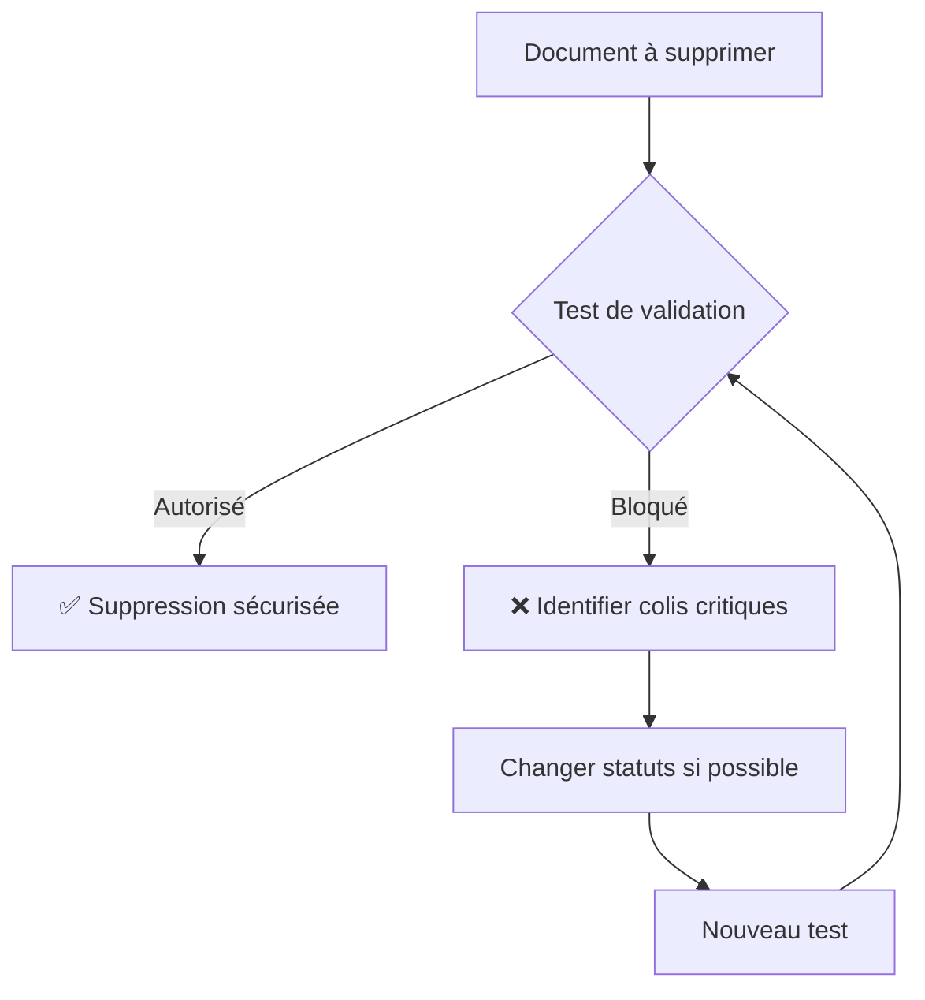

# 🧪 Scripts de Test - Validation de Suppression

## Vue d'ensemble

Ces scripts permettent de tester les validations de suppression des bons de livraison et des livraisons sans risquer de supprimer accidentellement des documents.

## 📁 Fichiers de Test

### 1. `test_delivery_note_deletion.py`
**Test des bons de livraison**

```bash
# Test simple
python test_delivery_note_deletion.py DN-001

# Exemple de sortie
🔍 Test de validation pour le bon de livraison: DN-001
============================================================
📊 Résumé:
   • Nombre total de colis: 3
   • Colis bloquants: 2
   • Colis autorisés: 1

📈 Répartition par statut:
   🔴 Livré: 1 colis
   🔴 Enlevé: 1 colis
   🟢 Nouveau: 1 colis

🎯 Résultat final: ❌ SUPPRESSION BLOQUÉE
```

### 2. `test_livraison_deletion.py`
**Test des livraisons**

```bash
# Test d'une livraison
python test_livraison_deletion.py LIV-001

# Test complet (BL + livraisons associées)
python test_livraison_deletion.py --full DN-001

# Exemple de sortie pour une livraison
🚚 Test de validation pour la livraison: LIV-001
============================================================
📊 Résumé:
   • Nombre total de colis: 5
   • Colis bloquants: 3
   • Colis autorisés: 2
   • Bons de livraison concernés: 2
   📋 Bons de livraison: DN-001, DN-002

🎯 Résultat final: ❌ SUPPRESSION BLOQUÉE
```

## 🎯 Utilisation

### Cas d'Usage Courants

1. **Vérification avant suppression**
   ```bash
   python test_delivery_note_deletion.py DN-001
   # Vérifie si le bon peut être supprimé
   ```

2. **Audit d'une livraison**
   ```bash
   python test_livraison_deletion.py LIV-001
   # Analyse complète des colis dans la livraison
   ```

3. **Test complet d'un workflow**
   ```bash
   python test_livraison_deletion.py --full DN-001
   # Teste le BL et toutes ses livraisons associées
   ```

## 📋 Informations Fournies

### Pour les Bons de Livraison
- ✅ Nombre total de colis liés
- ✅ Répartition par statut (critique/autorisé)
- ✅ Liste détaillée des colis
- ✅ Verdict final (suppression possible/bloquée)

### Pour les Livraisons
- ✅ Tous les éléments des bons de livraison +
- ✅ Bons de livraison concernés
- ✅ Informations sur le livreur et la date
- ✅ Analyse croisée BL-Livraison

## 🔧 Fonctions API

### Test Programmatique

```python
# Test d'un bon de livraison
result = frappe.call(
    "log.livraison_hooks.test_delivery_note_deletion_validation",
    delivery_note_name="DN-001"
)

# Test d'une livraison  
result = frappe.call(
    "log.livraison_hooks.test_livraison_deletion_validation",
    livraison_name="LIV-001"
)

# Vérifier le résultat
if result["can_delete"]:
    print("✅ Suppression autorisée")
else:
    print(f"❌ Bloqué par {result['blocking_colis_count']} colis critiques")
```

## 🚨 Statuts Bloquants

Les statuts suivants empêchent la suppression :

| Statut | Description | Raison |
|--------|-------------|---------|
| **`Livré`** | Livraison terminée | Historique important |
| **`Partiellement Livré`** | Livraison en cours | Données critiques |
| **`Enlevé`** | En transit | Traçabilité active |
| **`Non Livré`** | Échec de livraison | Données de suivi |

## ✅ Statuts Autorisés

| Statut | Description |
|--------|-------------|
| **`Nouveau`** | Pas encore traité |
| **`Préparé`** | Prêt mais pas enlevé |
| **`Annulé`** | Déjà annulé |

## 🔄 Workflow Recommandé



## 📞 Support

En cas de problème :

1. **Vérifier les permissions** Frappe
2. **S'assurer que le document existe**
3. **Vérifier la configuration** des hooks
4. **Consulter les logs** d'erreur Frappe

## 🔗 Fichiers Connexes

- `log/livraison_hooks.py` - Fonctions de validation
- `log/hooks.py` - Configuration des hooks
- `VALIDATION_SUPPRESSION_BON_LIVRAISON.md` - Documentation complète

---

*Ces outils garantissent une suppression sécurisée des documents critiques du système de livraison.*
