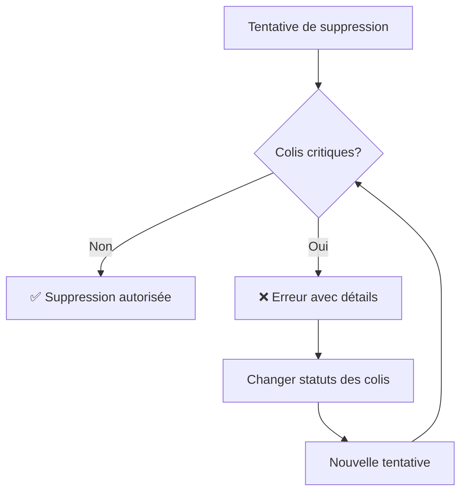

# 🛡️ Validation de Suppression des Bons de Livraison et Livraisons

## Vue d'ensemble

Cette fonctionnalité empêche la suppression accidentelle des **bons de livraison** et des **livraisons** qui ont des colis en cours de traitement ou déjà livrés, préservant ainsi l'intégrité des données et l'historique de livraison.

### 📦 Protection Dual-Level

1. **Bons de Livraison** : Protection contre la suppression si des colis critiques y sont liés
2. **Livraisons** : Protection contre la suppression si elles contiennent des colis critiques

## 🚨 Statuts qui Bloquent la Suppression

### ❌ **STATUTS CRITIQUES** (Suppression interdite)

| Statut | Raison du blocage | Impact |
|--------|-------------------|---------|
| **`Livré`** | Livraison terminée | Perte d'historique de livraison |
| **`Partiellement Livré`** | Livraison en cours | Incohérence des données |
| **`Enlevé`** | Colis en cours de livraison | Perte de traçabilité |
| **`Non Livré`** | Données de suivi importantes | Perte d'informations client |

### ✅ **STATUTS AUTORISÉS** (Suppression possible)

| Statut | Justification |
|--------|---------------|
| **`Nouveau`** | Pas encore traité |
| **`Préparé`** | Prêt mais pas encore enlevé |
| **`Annulé`** | Déjà annulé |

## 🔧 Implémentation Technique

### Hooks de Validation

```python
# hooks.py
"Delivery Note": {
    "before_delete": "log.livraison_hooks.validate_delivery_note_deletion",
    # ... autres hooks
},
"Livraison": {
    "before_delete": "log.livraison_hooks.validate_livraison_deletion",
    # ... autres hooks
}
```

### Fonctions de Validation

#### Pour les Bons de Livraison

```python
def validate_delivery_note_deletion(doc, method):
    """Empêche la suppression d'un bon de livraison avec des colis critiques"""
    
    BLOCKING_STATUSES = ["Livré", "Partiellement Livré", "Enlevé", "Non Livré"]
    
    colis_critiques = frappe.get_all("Colis", 
        filters={
            "bl": doc.name,
            "status": ["in", BLOCKING_STATUSES],
            "docstatus": ["<", 2]
        },
        fields=["name", "status"]
    )
    
    if colis_critiques:
        # Génère un message d'erreur détaillé
        frappe.throw("Message d'erreur avec détails des colis critiques")
```

#### Pour les Livraisons

```python
def validate_livraison_deletion(doc, method):
    """Empêche la suppression d'une livraison avec des colis critiques"""
    
    BLOCKING_STATUSES = ["Livré", "Partiellement Livré", "Enlevé", "Non Livré"]
    
    # Récupérer tous les colis liés à cette livraison
    colis_lies = [colis_row.colis for colis_row in doc.colis or [] if colis_row.colis]
    
    if colis_lies:
        colis_critiques = frappe.get_all("Colis", 
            filters={
                "name": ["in", colis_lies],
                "status": ["in", BLOCKING_STATUSES],
                "docstatus": ["<", 2]
            },
            fields=["name", "status", "bl"]
        )
        
        if colis_critiques:
            # Génère un message d'erreur avec info sur les bons de livraison
            frappe.throw("Message d'erreur avec détails des colis et BL")
```

## 🧪 Test de la Validation

### Fonctions de Test

#### Test des Bons de Livraison

```python
@frappe.whitelist()
def test_delivery_note_deletion_validation(delivery_note_name):
    """Teste la validation sans tenter de supprimer"""
    # Retourne un rapport détaillé sur la possibilité de suppression
```

#### Test des Livraisons

```python
@frappe.whitelist()
def test_livraison_deletion_validation(livraison_name):
    """Teste la validation de suppression d'une livraison"""
    # Retourne un rapport avec colis et bons de livraison concernés
```

### Scripts de Test

#### Test des Bons de Livraison

```bash
# Test d'un bon de livraison spécifique
python test_delivery_note_deletion.py DN-001

# Exemple de sortie:
🔍 Test de validation pour le bon de livraison: DN-001
============================================================
📊 Résumé:
   • Nombre total de colis: 3
   • Colis bloquants: 2
   • Colis autorisés: 1

📈 Répartition par statut:
   🔴 Livré: 1 colis
   🔴 Enlevé: 1 colis
   🟢 Nouveau: 1 colis

🎯 Résultat final: ❌ SUPPRESSION BLOQUÉE
```

#### Test des Livraisons

```bash
# Test d'une livraison spécifique
python test_livraison_deletion.py LIV-001

# Test complet (bon de livraison + livraisons associées)
python test_livraison_deletion.py --full DN-001

# Exemple de sortie pour une livraison:
🚚 Test de validation pour la livraison: LIV-001
============================================================
📊 Résumé:
   • Nombre total de colis: 5
   • Colis bloquants: 3
   • Colis autorisés: 2
   • Bons de livraison concernés: 2
   📋 Bons de livraison: DN-001, DN-002

📈 Répartition par statut:
   🔴 Livré: 2 colis
   🔴 Enlevé: 1 colis
   🟢 Nouveau: 1 colis
   🟢 Préparé: 1 colis

🎯 Résultat final: ❌ SUPPRESSION BLOQUÉE
```

## 💡 Utilisation

### Pour les Utilisateurs

1. **Tentative de suppression normale** dans l'interface Frappe
2. **Message d'erreur détaillé** si des colis critiques existent
3. **Actions recommandées** pour résoudre le blocage

### Pour les Développeurs

#### Test des Bons de Livraison

```python
# Test programmatique d'un bon de livraison
result = frappe.call(
    "log.livraison_hooks.test_delivery_note_deletion_validation",
    delivery_note_name="DN-001"
)

if result["can_delete"]:
    # Suppression autorisée
    frappe.delete_doc("Delivery Note", "DN-001")
else:
    # Traiter les colis critiques d'abord
    print(result["message"])
```

#### Test des Livraisons

```python
# Test programmatique d'une livraison
result = frappe.call(
    "log.livraison_hooks.test_livraison_deletion_validation",
    livraison_name="LIV-001"
)

if result["can_delete"]:
    # Suppression autorisée
    frappe.delete_doc("Livraison", "LIV-001")
else:
    # Traiter les colis critiques d'abord
    print(f"Blocage par {result['blocking_colis_count']} colis critiques")
    print(f"Bons de livraison concernés: {result['bon_livraison_list']}")
```

## 📋 Messages d'Erreur

### Exemples de Messages d'Erreur

#### Pour un Bon de Livraison

```
❌ Impossible de supprimer ce bon de livraison.

Des colis sont en cours de traitement :
• 2 colis 'Livré': DN-001-1, DN-001-2
• 1 colis 'Enlevé': DN-001-3

💡 Vous ne pouvez supprimer que les bons avec des colis ayant les statuts : 
'Nouveau', 'Préparé' ou 'Annulé'
```

#### Pour une Livraison

```
❌ Impossible de supprimer cette livraison.

Des colis sont en cours de traitement :
• 3 colis 'Livré': LIV-001-1, LIV-001-2, LIV-001-3
• 2 colis 'Enlevé': LIV-001-4, LIV-001-5

Bons de livraison concernés: DN-001, DN-002, DN-003

💡 Vous ne pouvez supprimer que les livraisons avec des colis ayant les statuts : 
'Nouveau', 'Préparé' ou 'Annulé'
```

## 🔍 Détails de l'Implémentation

### Vérifications Effectuées

#### Pour les Bons de Livraison

1. **Existence des colis** liés au bon de livraison (`bl = doc.name`)
2. **Statut de chaque colis** (critique ou autorisé)
3. **État du document** (non supprimé : `docstatus < 2`)
4. **Groupement par statut** pour un message clair

#### Pour les Livraisons

1. **Récupération des colis** liés via la table enfant `colis`
2. **Vérification des statuts** de tous les colis liés
3. **Identification des bons de livraison** concernés
4. **Groupement par statut** avec informations BL

### Performance

- **Requête optimisée** : utilise `frappe.get_all()` avec filtres
- **Traitement minimal** : seulement les champs nécessaires
- **Mise en cache** : pas de requêtes redondantes

### Sécurité

- **Validation côté serveur** : impossible de contourner
- **Hook `before_delete`** : bloque avant toute modification
- **Messages d'erreur informatifs** : guide l'utilisateur

## 🚀 Avantages

1. **Protection des données** : Empêche la perte d'historique pour BL et livraisons
2. **Intégrité référentielle** : Maintient la cohérence des relations colis-BL-livraison
3. **Expérience utilisateur** : Messages clairs et informatifs avec contexte
4. **Audit trail** : Préserve la traçabilité complète du processus
5. **Flexibilité** : Permet la suppression des cas non critiques
6. **Protection dual-level** : Sécurise à la fois les BL et les livraisons

## 🔄 Workflow Recommandé



## 📞 Support

En cas de problème avec la validation :

1. **Vérifier les statuts** des colis liés
2. **Utiliser la fonction de test** pour diagnostiquer
3. **Modifier les statuts critiques** si nécessaire
4. **Contacter l'administrateur** pour les cas particuliers

---

*Cette fonctionnalité garantit la sécurité et l'intégrité des données de livraison dans le système.*
